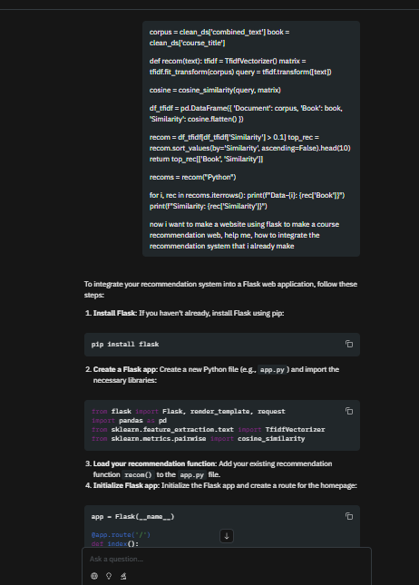
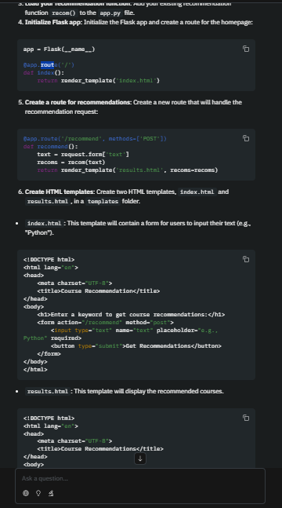
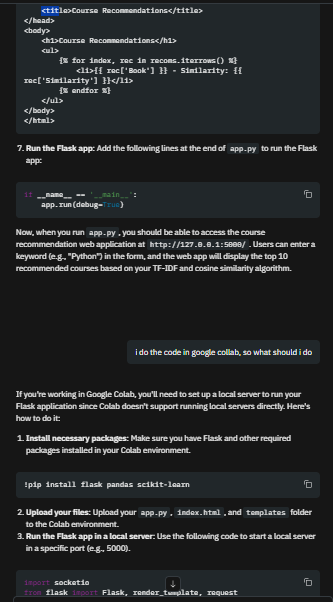
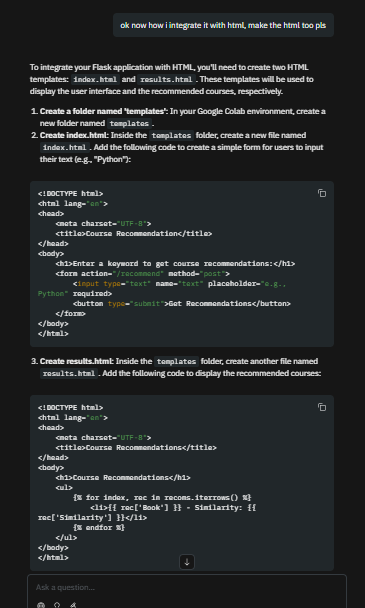

# RECourse
A web-based course recommendation engine designed to address the skills gap in the Indonesian job market by providing users with tailored international course suggestions.

RECourse is a platform that tackles the challenge of labor skills mismatch in Indonesia. Citing data from BPS, which indicates a low percentage of the workforce with higher education, our mission is to empower individuals by providing easy access to relevant courses.

This application is designed for all learners seeking to acquire new skills and enhance their competitiveness. Its key differentiator is the aggregation of courses from diverse international platforms, offering a broad spectrum of learning opportunities.

## Technologies used
Tech Stack

* **Frontend:** HTML, CSS, Vanilla JavaScript
* **Backend:** Python with Flask Framework
* **Dataset:** [Coursera Course Dataset 2023](https://www.kaggle.com/datasets/tianyimasf/coursera-course-dataset) from Kaggle
## Features
* **Subject-Based Recommendations:** Get personalized course suggestions by entering a skill or subject of interest.
* **International Course Aggregation:** Access and discover a wide variety of courses from multiple countries and platforms.
## Setup instructions
Make sure you have the following software installed:
* Python (3.9 or later)
* pip (Python package installer)
* Git

### Installation

1.  **Clone the repository**
    ```bash
    git clone https://github.com/BernardSantosa/Capstone-Project.git
    cd Capstone-Project
    ```

2.  **Install backend dependencies**
    ```bash
    pip install -r requirements.txt
    ```

3.  **Run the application**
    ```bash
    python app.py
    ```
    The application will be available at `http://127.0.0.1:5000`.

*(**Note:** If `npm install` is truly required for frontend tooling, you must add a "Frontend Setup" section and explain what it's for. Otherwise, remove it.)*
## AI support explanation
* **Function:** The recommendation engine utilizes a machine learning model to process user queries and match them with relevant courses from the dataset.
* **Technology:** The backend logic for query processing and data retrieval is handled by a Python script interacting with the Flask API.

## Prompt Example




